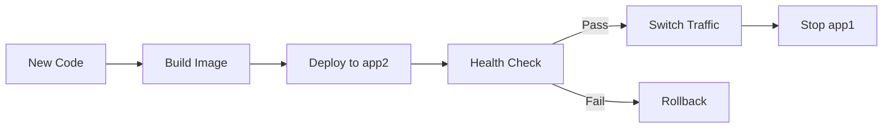

# GitHub Actions CI/CD Guide

**Date:** October 14, 2025  
**For:** Connect Platform Automation

---

## 🎯 Overview

This guide explains how to use the automated CI/CD workflows for the Connect platform using GitHub Actions.

---

## 📋 Workflows Overview

### **1. CI Workflow (ci.yml)**

**Triggers:**
- Pull requests to `main` or `develop`
- Pushes to `develop` branch

**What it does:**
- Runs tests on Node.js 18.x and 20.x
- Lints code
- Type checks TypeScript
- Security scanning (Trivy, npm audit)
- Build verification
- Coverage reporting

**Duration:** ~5-8 minutes

### **2. Deploy Production (deploy-production.yml)**

**Triggers:**
- Push to `main` branch
- Manual trigger via GitHub UI

**What it does:**
- Runs tests (skippable for emergencies)
- Builds Docker image
- Deploys to production server
- Blue-Green deployment
- Database migrations
- Health checks
- Auto-rollback on failure

**Duration:** ~3-5 minutes

### **3. Preview Deploy (preview-deploy.yml)**

**Triggers:**
- Pull request opened/updated to `main`

**What it does:**
- Builds PR preview
- Posts deployment info as PR comment
- Auto-cleanup when PR closes

**Duration:** ~3-4 minutes

---

## 🚀 Using the Workflows

### **Automatic Deployment (Recommended)**

```bash
# 1. Make your changes
git checkout -b feature/my-feature

# 2. Commit changes
git add .
git commit -m "feat: add new feature"

# 3. Push to GitHub
git push origin feature/my-feature

# 4. Create Pull Request
# - GitHub runs CI automatically
# - Review checks pass
# - Merge to main

# 5. Auto-deployment triggers
# - Merging to main triggers production deploy
# - Zero-downtime deployment
# - Health checks run
# - Done! ✅
```

### **Manual Deployment**

```bash
# 1. Go to GitHub Actions tab
# 2. Select "Deploy to Production"
# 3. Click "Run workflow"
# 4. Select branch (usually 'main')
# 5. Choose options:
#    - Skip tests: for emergency deploys
# 6. Click "Run workflow"
```

### **Emergency Deployment (Skip Tests)**

```bash
# When you need to deploy ASAP
# 1. Go to GitHub Actions
# 2. Deploy to Production workflow
# 3. Run workflow
# 4. Check "Skip tests"
# 5. Deploy

# ⚠️ Use only for:
# - Hotfixes
# - Security patches
# - Critical bugs
```

---

## 📊 Workflow Status

### **Check Workflow Status**

1. Go to **GitHub** → **Actions** tab
2. See recent workflow runs
3. Click on workflow for details

### **Status Badges**

Add to README.md:

```markdown


```

### **Email Notifications**

GitHub sends emails for:
- ✅ Successful deployments
- ❌ Failed workflows
- ⚠️ Security alerts

Configure in: Settings → Notifications → Actions

---

## 🔐 Required Secrets

All secrets must be configured in GitHub:

**Settings** → **Secrets and variables** → **Actions**

### **Production Deployment:**
- `PRODUCTION_SERVER_IP`
- `PRODUCTION_SERVER_USER`
- `PRODUCTION_SERVER_PASSWORD`
- `DB_PASSWORD`
- `JWT_SECRET`
- `NEXTAUTH_SECRET`

**See:** [GitHub Secrets Setup Guide](./GITHUB-SECRETS-SETUP.md)

---

## 🧪 Testing Locally

### **Simulate CI Workflow**

```bash
# Run tests
npm test

# Run linter
npm run lint

# Type check
npm run type-check

# Build
npm run build

# Security audit
npm audit
```

### **Test Docker Build**

```bash
# Build production image
docker build -f Dockerfile.production -t connect:test .

# Run container
docker run -p 3000:3000 connect:test

# Test health endpoint
curl http://localhost:3000/api/health
```

---

## 🎯 Workflow Features

### **Parallel Jobs**

CI workflow runs tests in parallel:
- Node 18.x tests
- Node 20.x tests
- Security scan
- Build check

This reduces total time by ~40%.

### **Caching**

Workflows use intelligent caching:
- npm dependencies cached
- Docker layers cached
- Next.js build cache

**First run:** ~8 minutes  
**Cached run:** ~3-4 minutes

### **Build Artifacts**

Deployment workflow:
1. Builds Docker image
2. Saves as artifact
3. Downloads on server
4. Loads and deploys

**Benefits:**
- Build once, deploy anywhere
- Faster deployments
- Reproducible builds

---

## 🔄 Blue-Green Deployment

### **How It Works**



### **Process**

1. **Current state:** app1 serving traffic
2. **New deployment:** app2 starts with new code
3. **Health check:** Verify app2 works
4. **Traffic switch:** Route users to app2
5. **Update app1:** Prepare for next deploy
6. **Cleanup:** Both apps ready

### **Advantages**

- ✅ Zero downtime
- ✅ Instant rollback
- ✅ Safe deployments
- ✅ Always have backup

---

## 🚨 Troubleshooting

### **Problem: Workflow Fails at "Install dependencies"**

**Cause:** package-lock.json mismatch

**Solution:**
```bash
# Delete and regenerate
rm package-lock.json
npm install
git add package-lock.json
git commit -m "fix: regenerate package-lock"
git push
```

### **Problem: Docker Build Fails**

**Cause:** Build context too large / Missing files

**Solution:**
```bash
# Check .dockerignore
echo "node_modules" >> .dockerignore
echo ".git" >> .dockerignore
echo ".next" >> .dockerignore

# Verify build locally
docker build -f Dockerfile.production -t test .
```

### **Problem: Deployment Fails at SSH**

**Cause:** SSH authentication failed

**Solution:**
```bash
# Verify secrets are set
gh secret list

# Test SSH manually
ssh user@59.21.170.6 'echo "Success"'

# Update secret if needed
gh secret set PRODUCTION_SERVER_PASSWORD
```

### **Problem: Health Check Fails**

**Cause:** App not starting / Wrong port

**Solution:**
```bash
# SSH to server
ssh user@59.21.170.6

# Check logs
docker logs connect_app1 --tail 50

# Check if running
docker ps | grep connect

# Manual health check
curl http://172.25.0.21:3001/api/health
```

### **Problem: Rollback Needed**

**Solution:**
```bash
# Automatic rollback (workflow does this)
# If manual needed:
ssh user@59.21.170.6
cd /opt/connect
docker-compose restart app1 app2

# Or use rollback script
./scripts/rollback-production.sh
```

---

## 📈 Optimizations

### **Speed Up Workflows**

**1. Cache Dependencies:**
```yaml
- uses: actions/cache@v3
  with:
    path: ~/.npm
    key: ${{ runner.os }}-node-${{ hashFiles('**/package-lock.json') }}
```

**2. Parallel Tests:**
```yaml
strategy:
  matrix:
    node-version: [18.x, 20.x]
```

**3. Skip Unchanged:**
```yaml
paths-ignore:
  - 'docs/**'
  - '**.md'
```

### **Reduce Costs**

GitHub Actions free tier:
- 2,000 minutes/month (free)
- Public repos: unlimited

**Tips:**
- Use self-hosted runners for heavy workloads
- Cache aggressively
- Skip non-essential jobs

---

## 🎨 Customizing Workflows

### **Add New Job**

```yaml
jobs:
  my-custom-job:
    name: My Custom Job
    runs-on: ubuntu-latest
    steps:
      - uses: actions/checkout@v4
      - run: echo "Custom step"
```

### **Add Slack Notifications**

```yaml
- name: Notify Slack
  uses: slackapi/slack-github-action@v1
  with:
    webhook-url: ${{ secrets.SLACK_WEBHOOK }}
    payload: |
      {
        "text": "Deployment ${{ job.status }}"
      }
```

### **Add Environment**

```yaml
environment:
  name: production
  url: https://connectplt.kr
```

---

## 📚 Best Practices

### **1. Always Test Before Deploy**
- Run CI on all PRs
- Require passing checks
- Review before merge

### **2. Use Semantic Commits**
```bash
feat: add new feature
fix: resolve bug
docs: update documentation
chore: update dependencies
```

### **3. Monitor Workflows**
- Check Actions tab daily
- Review failed runs
- Fix broken workflows immediately

### **4. Security**
- Rotate secrets regularly
- Use environment protection
- Audit workflow permissions

### **5. Documentation**
- Document custom workflows
- Update guides when changing
- Share knowledge with team

---

## 📊 Metrics

Track these metrics:

| Metric | Target | Current |
|--------|--------|---------|
| **Deployment Frequency** | Daily | - |
| **Success Rate** | > 95% | - |
| **Mean Time to Deploy** | < 5 min | ~3-4 min |
| **Rollback Rate** | < 2% | - |

---

## 🔗 Related Documentation

- [GitHub Secrets Setup](./GITHUB-SECRETS-SETUP.md)
- [Email Alerts Setup](./EMAIL-ALERTS-SETUP.md)
- [Deployment Guide](../../scripts/DEPLOYMENT-GUIDE.md)
- [Docker Optimization](../optimization/BUILD-OPTIMIZATION-REPORT.md)

---

## 💡 Quick Commands

```bash
# Check workflow status
gh run list

# View workflow logs
gh run view <run-id> --log

# Re-run failed workflow
gh run rerun <run-id>

# Trigger deployment
gh workflow run deploy-production.yml

# List secrets
gh secret list

# Add secret
gh secret set SECRET_NAME
```

---

**Last Updated:** October 14, 2025  
**Status:** Production Active

